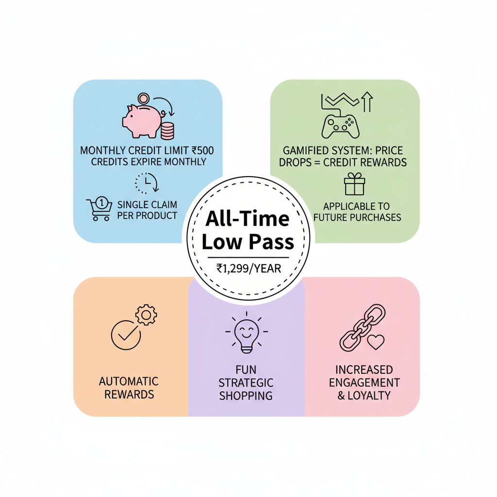

# 📑 Case Study  
# 💰🛒 All-Time Low Pass – Price Prediction & Reward System  

A subscription-based, gamified price protection system that **lets customers claim price drops and accumulate credits** to maximize savings — designed for online shoppers, Super market apps, deal hunters, and loyal app users.  

---

## 1. 🧩 Overview  

**All-Time Low Pass** empowers online shoppers to:  
- Claim the price difference when purchased products drop in cost  
- Accumulate credits in a monthly pass (capped at ₹500/month)  
- Apply credits to partially pay for future purchases  
- Transform shopping into a **strategic and engaging game of price prediction**  

---

## 2. ✨ The Story – The Spark  

<table>
<tr>
<td width="40%" align="center" valign="middle">

</td>
<td width="60%" valign="top">

**Picture this:**  
A customer buys a pair of shoes for ₹1,000. A week later, the price drops to ₹900. Normally, they would **miss the difference**, leading to frustration.  

**In future:**  
Customers may delay their purchase decisions — each time they’re about to click “Buy,” they hesitate, wondering if the price might drop tomorrow. 

> ❌ This hesitation repeats in a loop, hurting sales and weakening customer confidence.

</td>
</tr>
</table>

---

# 🧠 The Innovation 

## 3.📊 Real Customer Journey (Simplified) 

| Week | Action | Price | Claim / Credit |
|------|--------|-------|----------------|
| 1 | Customer buys Shoes | ₹1,000 | If the price drops to ₹900 the next day → Customer instantly receives ₹100 credit |
| 2 |Customer buys Shirt | ₹1,000 | They use the ₹100 credit → They pay only ₹900 for there shirts |
| 3 | Customer buys Watch | ₹2,000 | If the price watch drops to ₹1,950 the next day → Customer receives ₹50 credit for future purchases (within the ₹500/month limit) |

> **🔑 Key Insight: 
Once the customer buys the first product from your shop (ex: shoes), they will keep coming back to your shop for the next product (shirt, watch, etc.) — because their credits work only in your shop.
This locks in repeat purchases and stops them from going to competitors.**

---

## 4. 🧭 How it workd - Prototype Flow  

1. 🛍️ Buy a product → Price is tracked automatically  
2. 📉 Price drops → Claim difference (once per product)  
3. 💵 Credit added to All-Time Low Pass → Max ₹500/month  
4. 👕 Use credits for next purchase → Pay remaining from pocket  
5. ⏳ End-of-month → Unused credits expire → Encourages new purchases  
6. 🔁 Repeat cycle → Continuous engagement  

---

## 5. ⚙️ Features  

- **📉 Price Drop Tracking:** Automatic monitoring of purchased items  
- **🔒 Single Claim per Product:** Prevents abuse and simplifies tracking  
- **💰 Monthly Credit Cap:** ₹500/month to control risk  
- **🎟️ Flexible Credit Usage:** Apply credits to any eligible purchase within the month  
- **🎮 Gamified Experience:** Predict which products might drop in price  
- **🔔 Real-Time Notifications:** Alerts for price drops and expiring credits  
- **📆 End-of-Month Summary:** Encourages credit utilization and repeat purchases  

---

## 6. 🧠 Solution  

<table>
<tr>
<td width="40%" align="center" valign="middle">

</td>
<td width="60%" valign="top">

> **All-Time Low Pass** is a subscription-based, gamified system that rewards users for price drops:  

- **Monthly credit limit:** ₹500  
- **Credit expiration:** End of each month  
- **Single claim per product:** Prevents misuse and simplifies tracking  
- **Free Tier (Limited):** Track up to 5 products
- **Yearly subscription(Optional):** ₹1,299/year 

### 🚀 Benefits  

- Automatically rewards users for price drops  
- Credits can be applied to future purchases  
- Makes shopping a **fun and strategic experience**  
- Boosts user engagement, retention, and loyalty  

</td>
</tr>
</table>

---

---

## 7. 🎯 Benefits  

> 💡 Real-Life Scenario:
> - A customer buys a product and receives a ₹100 reward through the system.
> - This small win brings a sense of satisfaction and excitement, making the customer feel valued.
> - They realize they’re not just spending money — they’re also earning value with every purchase.
> - Encouraged by this, the customer becomes motivated to buy more products to earn additional rewards.
> - Over time, these rewards are reinvested in future purchases, forming a purchase → reward → repurchase cycle.
> - This continuous loop strengthens customer trust, engagement, and loyalty.
> - As customers feel more confident and rewarded, their buying frequency and connection with the brand increase.
<table>
<tr>
<td width="40%" align="center" valign="middle">

</td>
<td width="60%" valign="top">

### 👥 For Users  
- Save automatically on price drops  
- Engage with a gamified shopping experience  
- Make strategic purchases with planning  
- Incentivized repeat purchases through credits  

</td>
</tr>
</table>

---

<table>
<tr>
<td width="55%" align="center" valign="middle">

</td>
<td width="60%" valign="top">

### 🏢 For Business / Platform  
- Subscription revenue from All-Time Low Pass  
- Increased app engagement and retention  
- Predictable revenue through monthly credit caps  
- Upselling opportunities for higher-value purchases  
- Differentiates platform with **loyalty-driven gamification**  

</td>
</tr>
</table>

---

## 8. 👤 Target Audience  

- **🛒 Frequent Online Shoppers:** Looking for savings and deals  
- **🎮 Deal Hunters & Gamers:** Users who enjoy strategizing purchases  
- **📱 Millennials & Gen Z:** Highly engaged with apps and gamified experiences  
- **🛍️ High-Traffic E-commerce Users:** Benefit from multi-category purchase tracking  

---

## 9. 🌏 Market Opportunity  

- **India Online Shopping:** ~100M active users  
- Estimated 5–10M potential All-Time Low Pass subscribers initially  
- Opportunity to **boost monthly active users, repeat purchases, and basket size**  

---

## 10. 💰 Revenue Opportunity  

| User Segment | Users | Monthly Revenue (₹) | Annual Revenue (₹ Cr) |
|---------------|--------|--------------------|----------------------|
| Subscribers (1–2 M) | 1,000,000 | 10–12 Cr | 120–144 |
| High-Engagement Users | 500,000 | 4–5 Cr | 48–60 |
| **Total** | 1,500,000 | 14–17 Cr | 168–204 |

### Additional Revenue Streams  
- Premium subscription tiers  
- Multi-item prediction games  
- Promotional tie-ins with discounts  

---

## 11. 🧩 Competitive Advantage  

- Combines **price protection + gamification + subscription model**  
- Predictive and fun: users **strategize purchases**  
- Single-claim rules and monthly caps **control risk**  
- Increases **app stickiness and repeat engagement**  
- Can integrate with **push notifications, dashboards, and product suggestions**  

---

## 12. 💻 Prototype Tech  

- **Stack:** HTML, CSS, JavaScript (frontend prototype)  
- **Core Features:**  
  - Track purchase prices  
  - Calculate claimable credit  
  - Apply credit to new purchases  
  - Monthly summary and expiration notifications  
- **Future Enhancements:** Backend integration, app notifications, analytics dashboard  

---

## 13. 🏁 Conclusion  

**All-Time Low Pass** is a **strategic, gamified solution** that:  
- Turns shopping into a **prediction game**  
- Rewards users with **credits for price drops**  
- Encourages **repeat purchases and engagement**  
- Balances **user savings with predictable revenue**  

### 🏷️ Tagline  
> “Predict, claim, save — play the game, shop smarter.”  

---

### 🔑 Takeaway  
**Gamify shopping → Retain customers → Build revenue**  

---

### ✍️ Author  
**Raguram Narayanaswamy**  

📂 **Repo Purpose:**  
Product Case Study & Growth Proposal for e-commerce and supermarkets, and also how to expand the revenue bandwidth. 
